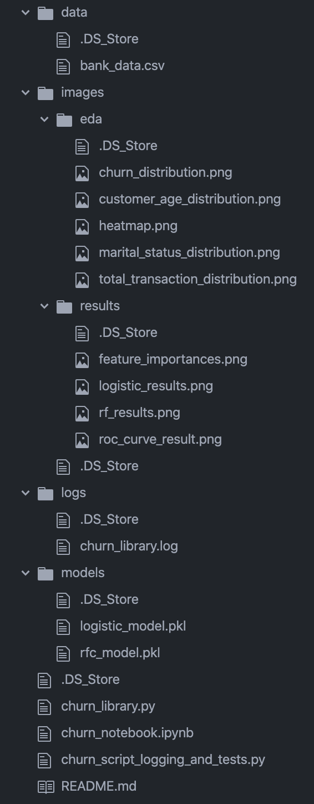

<code>EMMANUEL AKINWALE  
    April 14, 2022  
    Customer Churn Udacity MLOps 1st Project</code>

<h1> README.md</h1>

This file will provide an overview of the project, the instructions to use the code, for example, it explains how to test and log the result of each function. For instance, you can have the following detailed sections in the README.md file:

<ol><li>Project description</li>
<li>Files and data description</li>
<li>Running the files</li></ol>

<h1> Predict Customer Churn</h1>

- Project **Predict Customer Churn** of ML DevOps Engineer Nanodegree Udacity

<h2>**Project Description</h2>

In this project, you will implement your learnings to identify credit card customers that are most likely to churn. The completed project will include a Python package for a machine learning project that follows coding (PEP8) and engineering best practices for implementing software (modular, documented, and tested). The package will also have the flexibility of being run interactively or from the command-line interface (CLI).

This project will give you practice using your skills for testing, logging, and best coding practices from this lesson. It will also introduce you to a problem data scientists across companies face all the time. How do we identify (and later intervene with) customers who are likely to churn?

Below are the first few rows associated with the dataset for this project, which was pulled from Kaggle.
 

<h2>**Files and data description</h2>
Overview of the files and data present in the root directory.

The project requires completed versions of these files:

<ol><li>churn_library.py</li>
    <li>churn_script_logging_and_tests.py</li>
    <li>README.md</li></ol>

The file structure of a completed project should be similar to the below:

    

<h3> Save Images & Models</h3>

<h3>Store result plots including at least one:</h3>
<ol>
    <li>Univariate, quantitative plot</li>
    <li>Univariate, categorical plot</li>
    <li>Bivariate plot</li>
</ol>

<h3> Store result plots including:</h3>
<ol>
    <li>ROC curves</li>
    <li>Feature Importances</li></ol>
    
<h2> Running Files</h2>
How do you run your files? What should happen when you run your files?

<h3>
Requirement.txt
</h3>

**For python 3.8 
    Run<code>requirements_py3.8.txt</code>

**For python 3.6 
    Run<code>requirements_py3.6.txt</code>

<h3> File for find customers who are likely to Churn</h3>
<code>churn_library.py</code>

The churn_library.py is a library of functions to find customers who are likely to churn. You may be able to complete this project by completing each of these functions, but you also have the flexibility to change or add functions to meet the rubric criteria.

The document strings have already been created for all the functions in the churn_library.py to assist with one potential solution. In addition, for a better understanding of the function call, see the Sequence diagram in the classroom.

After you have defined all functions in the churn_library.py, you may choose to add an if __name__ == "__main__" block that allows you to run the code below and understand the results for each of the functions and refactored code associated with the original notebook.

<h3> Test and Logging </h3>
<code>churn_script_logging_and_tests.py</code>

This file contains unit tests for the churn_library.py functions. You have to write test for each input function. Use the basic assert statements that test functions work properly. The goal of test functions is to checking the returned items aren't empty or folders where results should land have results after the function has been run.

Log any errors and INFO messages. You should log the info messages and errors in a .log file, so it can be viewed post the run of the script. The log messages should easily be understood and traceable.

Also, ensure that testing and logging can be completed on the command line, meaning, running the below code in the terminal should test each of the functions and provide any errors to a file stored in the /logs folder.

